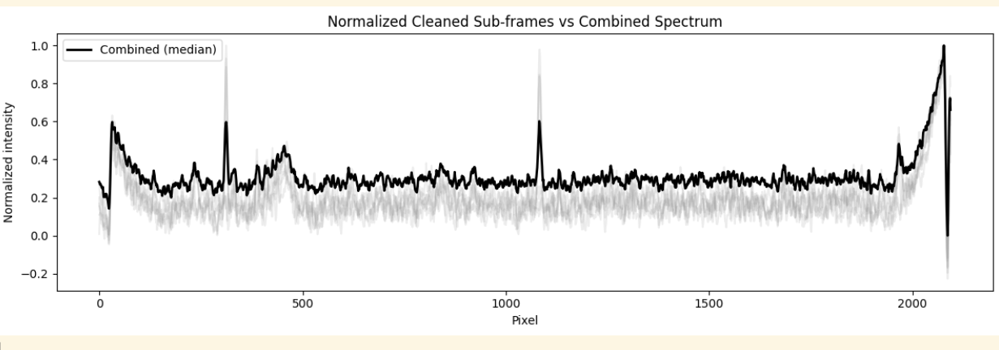

# LIBS Spectra Workbench

**An End-to-End Analysis Pipeline for Chandrayaan-3 LIBS Data**

---

## Overview

LIBS Spectra Workbench is an open-source Python toolkit for analyzing **Laser-Induced Breakdown Spectroscopy (LIBS)** data acquired by the **Chandrayaan-3 lunar rover**.  
It implements a complete, scientifically grounded pipeline that converts raw rover telemetry into calibrated, interpretable emission spectra with interactive visualization.

The project emphasizes robustness, transparency, and reproducibility, closely mirroring how real planetary spectroscopy pipelines are designed and validated.

---

## Key Features

- Parsing of Chandrayaan-3 LIBS Level-0 CSV telemetry  
- Baseline correction using Asymmetric Least Squares (AsLS)  
- Noise suppression and spectral cleaning  
- Robust emission peak detection  
- Matching of peaks to atomic reference emission lines  
- Peak persistence analysis across sub-frames  
- Sub-frame and shot quality scoring  
- Shot-quality-weighted wavelength calibration  
- Persistence-based sub-frame combination for high-SNR spectra  
- Interactive Plotly-based spectral viewer with peak metadata  

---

## Data Source

- **Mission:** Chandrayaan-3  
- **Instrument:** LIBS (Laser-Induced Breakdown Spectrometer)  
- **Data Level:** Level-0 (raw telemetry)  
- **Format:** CSV files containing metadata and CCD pixel intensities  

Each LIBS firing may contain multiple CCD sub-frames corresponding to repeated readouts of the same laser shot.

---

## Processing Pipeline

```mermaid
flowchart TD
    A[Raw LIBS CSV Files] --> B[Parse Metadata & Pixel Columns]
    B --> C[Sub-frame Cleaning]
    C --> D[Baseline Removal (AsLS)]
    D --> E[Noise Smoothing]
    E --> F[Peak Detection]
    F --> G[Reference Line Matching]
    G --> H[Peak Persistence Analysis]
    H --> I[Sub-frame Quality Scoring]
    I --> J[Shot Quality Scoring]
    J --> K[Weighted Wavelength Calibration]
    H --> L[Persistence-based Sub-frame Combination]
    K --> M[Calibrated Spectrum]
    L --> M
    M --> N[Interactive Spectral Viewer]
```

---

## Methodology Summary

### Spectral Cleaning  
Raw CCD spectra are baseline-corrected using Asymmetric Least Squares to remove continuum emission and detector bias, followed by mild smoothing to suppress high-frequency noise while preserving emission peaks.

### Peak Detection & Matching  
Emission peaks are detected using prominence-based criteria and matched against known atomic emission lines using a provisional calibration and wavelength tolerance windows.

### Peak Persistence & Quality Scoring  
True LIBS emission lines are expected to recur across sub-frames. Peak persistence metrics are computed to quantify reliability, enabling sub-frame and shot-level quality scoring.

### Wavelength Calibration  
A linear wavelength calibration model is fitted per day using matched peaks. Calibration points are weighted by shot quality, improving robustness against noisy or unstable firings.

### Sub-frame Combination  
Multiple sub-frames from a single shot are combined using median aggregation, guided by persistence information when available, to produce high signal-to-noise spectra.

---

## Interactive Visualization

An interactive Plotly viewer allows:

- Zooming and panning across the spectrum  
- Hovering over detected peaks to view:
  - detected wavelength  
  - matched element  
  - reference wavelength  
  - confidence score  
- Overlay of reference emission lines  

---

## Example Outputs

*(Add generated plots and screenshots here)*


---

## Usage

### Run Analysis

```python
from lunar_spectra_workbench.pipeline import analyze_day

result = analyze_day("data/raw/20230902")
```

### Launch Interactive Viewer

```python
from lunar_spectra_workbench.viewer import show_spectrum

show_spectrum(result, shot_id="ch3_lib_045_20230902T074049_00")

# 
```

---

## Project Structure

```
LIBS_spectra_workbench/
│
├─ lunar_spectra_workbench/
│  ├─ load.py
│  ├─ clean.py
│  ├─ peaks.py
│  ├─ match.py
│  ├─ consistency.py
│  ├─ calibration_fit.py
│  ├─ calibration.py
│  ├─ combine.py
│  ├─ viewer.py
│  └─ pipeline.py
│
├─ notebooks/
│  └─ sandbox.ipynb
│
├─ data/
│  └─ raw/
│
└─ README.md
```

---

## Design Principles

- No hard-coded assumptions about data quality  
- Graceful handling of low-SNR or sparse data  
- Visualization used as a validation tool  
- Modular, extensible pipeline design  

---

## Limitations & Future Work

- Elemental abundance estimation is not yet implemented  
- Plasma temperature and matrix effects are not modeled  
- Reference line database is limited  

---

## License

Open for academic and educational use.
